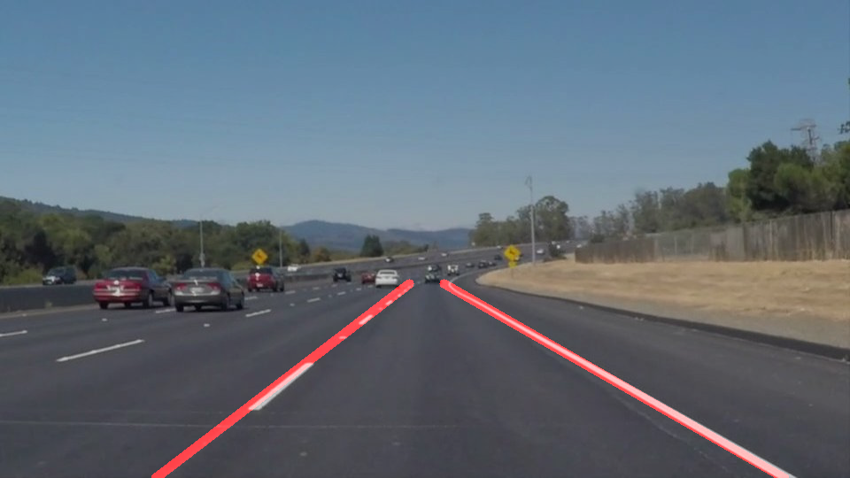
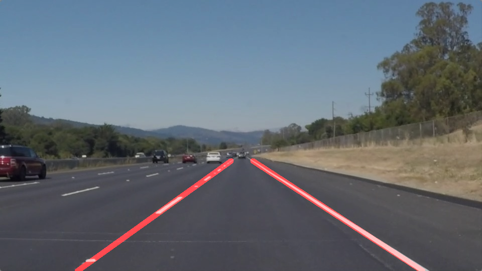
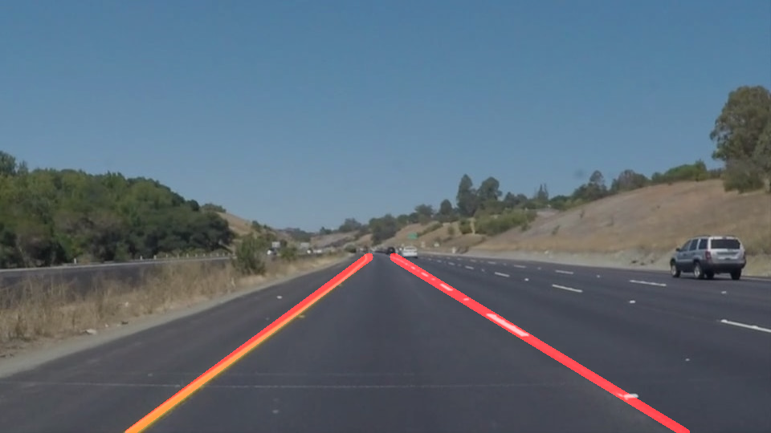
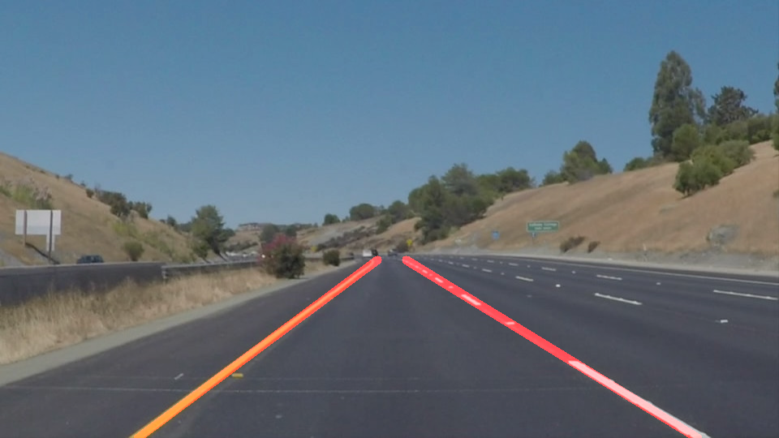
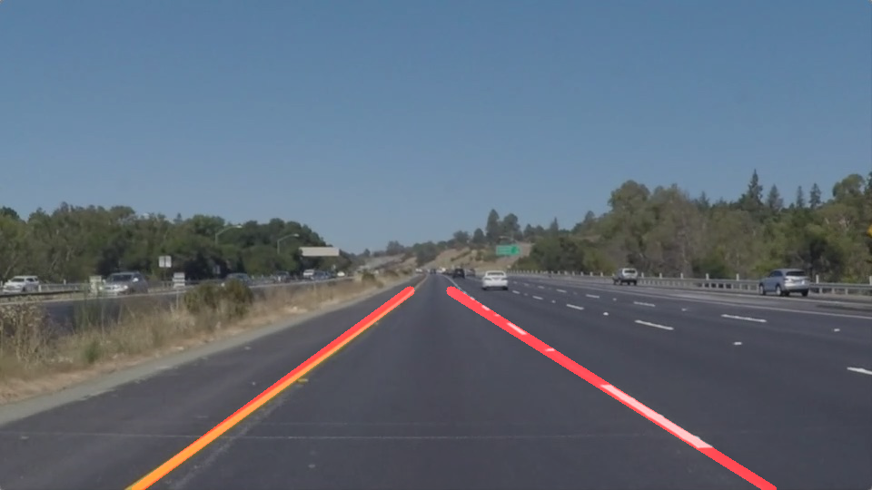
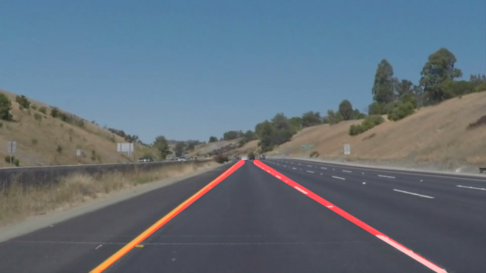

# **Finding Lane Lines on the Road** 

### 1. Pipeline Description

My pipeline consisted of following steps. 
* Gray Scale: convert image in to gray scale.
* Gaussian Blur: apply Gaussian Blur to smooth gray scaled image.
* Canny edge detection: apply Canny Edge detection to generate edges.
* Mask: apply a mask to only kee
* Hough Transform:
* Draw lines: 
    *first
    *second

Final results:

Images

|  |  |  |
|:---:|:---:|:---:|
|  |  |  |

Videos:

<video width="320" height="240" controls>
  <source src="test_videos_output/solidWhiteRight.mp4" type="video/mp4">
</video>

### 2. Shortcomings

One potential shortcoming is t

### 3. Possible Improvements

A possible improvement would be to ...

Another potential improvement could be to ...
