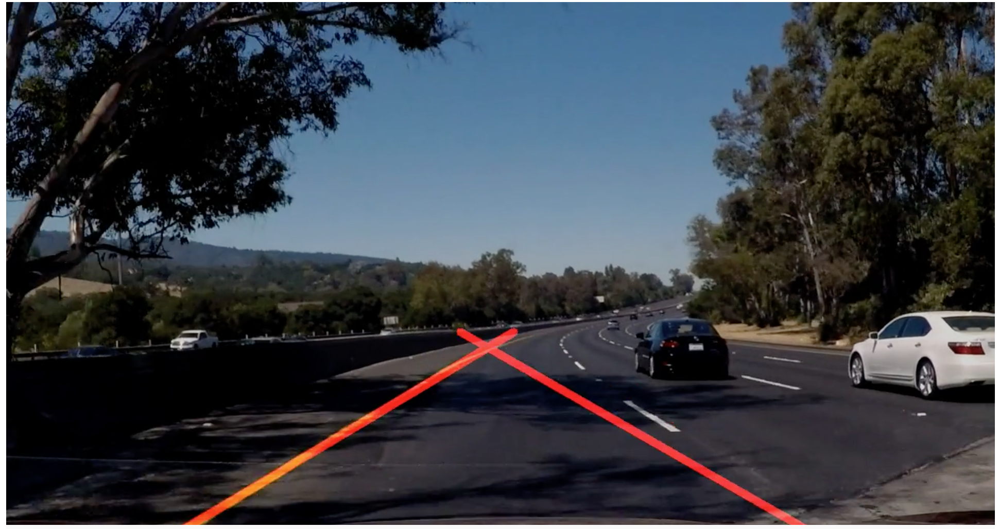

# **Finding Lane Lines on the Road** 

### 0. Setup
* Clone this repo.
* Download [docker image](https://github.com/udacity/CarND-Term1-Starter-Kit)
* Start docker and notebook
    ```
    docker run -it --rm -p 8888:8888 -v `pwd`:/src udacity/carnd-term1-starter-kit P1.ipynb
    ```
### 1. Pipeline Description

My pipeline consisted of following steps. 
* Gray Scale: convert image in to gray scale.
* Gaussian Blur: apply Gaussian Blur to smooth gray scaled image.
* Canny Edge Detection: apply Canny Edge detection to generate edges.
* Mask: apply a mask to only keep edges inside bottom trapezoid.
* Hough Transform: generate lines from edges.
* Draw lines:
Following steps are taken for generating one line for left lane and one line for right lane.
Taking line for left lane as an example.
    1. remove outliers with outstanding slope
    
        Rejecting all lines with slope not in the range of a heuristic (-0.7) ± delta (0.2).
    
    2. extrapolate lines
    
        Extrapolate remaining lines to full height of the mask.
    
    3. remove outliers with outstanding position
    
        Since all remaining line have similar slope, I use mid points of the indicator of line position.
I removed all lines with x value not in the range of mean ± 2 * std.
    
    4. average all remaining lines and generate the final line

    5. do not produce the final line if no lines pass previous steps.

Repeat the same step for right lane with 0.7 as the heuristic for slope.

Final results:

Images

|  |  |  |
|:---:|:---:|:---:|
|  |  |  |

Videos - Please clone this repo and check them out at ./test_videos_output

### 2. Shortcomings

| error1 | error2 |
|:---:|:---:|
|  |  |

One potential shortcoming is that the detector performs not well on curved dashed lane lines
if there is no line segment close to the bottom of the image.
Since I only select lines with slope close to a heuristic, the top half of curve lane
(usually has very different slope) are discarded.
If there is no line segment close to the bottom of the image, it is very likely that no final line will be generated.

### 3. Possible Improvements

A possible fix to the shortcoming is that we can cache generated lane line in previous frames
of the video. If no new lane line gets generated, we can fall back to the previous one.
